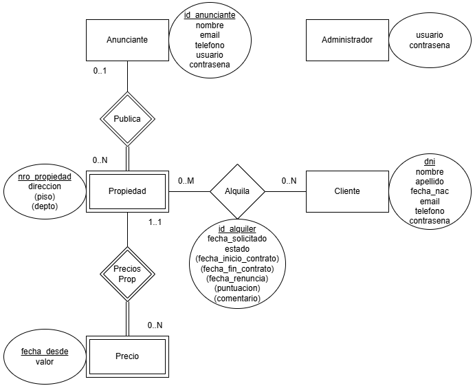

# TP Java - Inmobiliaria: Gestión de Alquileres de Propiedades

## Listado de Integrantes

- 46917 - Soto, Matías Francisco (único integrante)

## Enunciado general del TP

El sistema permite gestionar la oferta y demanda de propiedades para alquilar. A través del mismo, los anunciantes podrán registrar y administrar sus propiedades, mientras que los Clientes tendrán la posibilidad de consultar las propiedades disponibles, solicitar visitas a las mismas y, una vez alquilada una propiedad, gestionar su alquiler actual. Además, existe un administrador que tiene acceso total a los registros de la base de datos del sistema y que se encarga de resolver incidencias o conflictos que puedan surgir.

Queda fuera del alcance del sistema la gestión y procesamiento de pagos de alquileres. El Anunciante podrá manejar los precios de las propiedades, pero no se realizarán gestiones relacionadas con los pagos.

## Modelo de Datos

## Listado de Casos de Uso

- Reservar propiedad
- Alquilar propiedad
- Valorar alquiler
- Finalizar alquiler
- Cancelar reserva
- Cancelar alquiler

## Caso de Uso nivel resumen "Alquilar propiedad"

Abarca desde que el Cliente desea reservar una propiedad para coordinar una visita, pasando por la confirmación del alquiler y la ejecución del contrato, hasta que el contrato del Cliente termina y el Anunciante confirma la finalización del mismo.

## Listado complejo

El Anunciante puede consultar un listado de alquileres en estado Pendiente o En curso, y aplicar filtros para visualizar cada uno por separado.

## Niveles de acceso

El sistema distingue 3 roles diferentes:
- Clientes
- Anunciantes
- Administrador(es)
